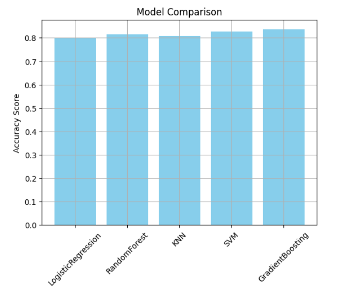

# 💼 Employee Salary Prediction using GradientBoosting Classifier

This project is a **Capstone Machine Learning project** focused on predicting whether an employee earns more than $50K per year using demographic and employment data.

The model is trained on the **UCI Adult Income Dataset**, and various ML algorithms were applied. After comparison, the **GradientBoosting Classifier** was chosen as the best-performing model.

---

## 📌 Project Objective

To build a machine learning model that classifies employee salaries as either `<=50K` or `>50K` annually, which can help organizations in:
- Budget forecasting
- Strategic hiring
- Salary planning and optimization

---

## 🧠 Machine Learning Algorithms Used

- Logistic Regression
- Random Forest Classifier
- K-Nearest Neighbors (KNN)
- Gradient Boosting Classifier ✅ (Best Accuracy)
- Support Vector Classifier (SVC)

---

## 🔧 System Requirements

- OS: Windows 10 or higher
- RAM: 8 GB or more
- IDE: Jupyter Notebook / Google Colab
- Python: v3.8+

---

## 📚 Libraries Used

| Library        | Purpose                                  |
|----------------|-------------------------------------------|
| NumPy          | Numerical operations                      |
| Pandas         | Data loading and preprocessing            |
| Seaborn        | Statistical data visualization            |
| Matplotlib     | Plotting charts and outlier detection     |
| Scikit-learn   | Machine Learning models and evaluation    |
| Joblib         | Model saving and loading                  |
| Streamlit (optional) | Web app deployment                  |

---

## ⚙️ Project Workflow

1. **Data Loading** – Loaded the UCI Adult dataset.
2. **Data Cleaning** – Removed missing/null values.
3. **EDA** – Visualized correlation matrix and outliers.
4. **Preprocessing** – Label encoding of categorical features.
5. **Train-Test Split** – Used 80/20 split.
6. **Model Training** – Trained multiple classifiers.
7. **Evaluation** – Compared accuracy, precision, recall, and F1-score.
8. **Model Saving** – Best model (GradientBoosting) saved using `joblib`.

---

## 🛠️ How to Run the Project

### 🧪 Step 1: Clone the Repository
```bash
git clone https://github.com/sarc-nitish/Employee-Salary-Prediction.git
```

### 🧹 Step 2: Install Dependencies
```bash
pip install -r requirements.txt
```

### 🚀 Step 3: Run the Jupyter Notebook
Open `employee salary prediction.ipynb` in Jupyter Notebook or Google Colab and run all the cells sequentially.

### 🌐 Optional: Run the Streamlit App 
Open `app.py`
```bash
streamlit run app.py
```

---

## 📊 Results

- Best Accuracy: **GradientBoosting Classifier**
- Final Prediction Output:
  ```
  ✅ Prediction: Estimated Annual Income is ≤ $50,000
  ```

- Accuracy Comparison Graph:



---

## 🔗 GitHub Repository

👉 [Click here to view the repository](https://github.com/sarc-nitish/Employee-Salary-Prediction.git)

---

## 🧾 References

- [UCI Adult Dataset](https://archive.ics.uci.edu/ml/datasets/adult)
- [Scikit-learn Documentation](https://scikit-learn.org/)
- [Pandas Documentation](https://pandas.pydata.org/)
- [Seaborn Docs](https://seaborn.pydata.org/)
- [Matplotlib Docs](https://matplotlib.org/)

---

## 👨‍💻 Author

**Nitish Kumar**  
Haldia Institute of Technology  
Department: Information Technology  
